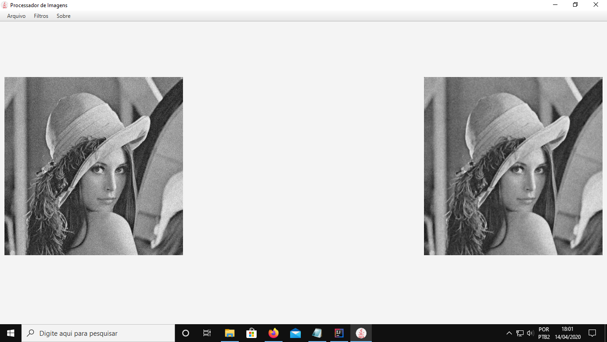

# Processador digital de imagens
Feito com java e framework javaFx
## Screenshot

## Operações Adicionadas

### Separar Bandas R,G,B
### Cinza R, G, B e M
### Negativo RGB e YIQ
### Conversão RGB para YIQ e vice versa
### Binarização
### Brilho aditivo em RGB
### Brilho aditivo em Y
### Brilho multiplicativo em RGB
### Brilho multiplicativo em Y
### Aumento de tonalidade
### Operações Locais: Convolução
### Operações Locais: Mediana
### Operações Locais: Moda
### Ruído de método
### Inserção de ruído Salt and Pepper
